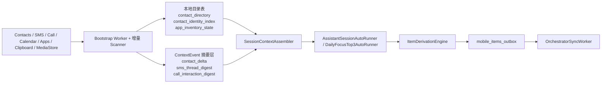

# Context 目录投影与首扫增量实施计划

> **给执行型 agent 的要求：** 必须使用 `superpowers:subagent-driven-development`（推荐）或 `superpowers:executing-plans` 按任务逐步执行。所有步骤都使用复选框（`- [ ]`）追踪。

**目标：** 在不破坏当前 `ContextEventStore -> ItemDerivationEngine -> mobile_items_outbox -> OrchestratorSyncWorker` 链路的前提下，引入“目录投影层 + 首扫 + 增量 + 15 分钟总结”模型，让 contacts 成为 P0 核心源，并让 SMS / Call / Apps 能和 contacts 稳定关联。

**架构：** 保留现有 `ContextEvent`、`mobile_items_outbox` 和同步协议；新增本地目录表承接全量原料，`ContextEvent` 只承接 delta / digest。首次 bootstrap 使用独立 `WorkManager` 任务快速扫完，后续增量由 `ContentObserver`、广播和 60 秒 service tick 共同驱动。`assistant_session` 继续按 15 分钟 bucket 运行，但只消费最近增量和最新目录摘要。

**技术栈：** Kotlin、Android ContentProvider / `ContactsContract` / `Telephony` / `CallLog` / `MediaStore` / `PackageManager`、`PhoneNumberUtils`、WorkManager、SQLite、JUnit

---

## 硬约束

1. Contacts 不再被视为 `contactsCount` 计数信号，必须有独立的目录投影任务和目录表。
2. 全量联系人、全量 App 清单这类原料不允许直接塞进 `ContextEvent.payload`。
3. `ContextEvent` 只记录 `delta / digest / summary-ready evidence`，不记录整份目录。
4. 所有可关联身份都必须先归一化，再生成稳定 hash，不能用 `maskAddress()` 一类展示串做 join key。
5. 首次 bootstrap 不能绑在 60 秒前台 tick 上，必须使用独立 worker 加速完成。
6. 15 分钟总结只消费“最近增量 + 最新摘要”，不能回放整段 bootstrap 历史。

## 数据流



## 统一规范

### 1. `collector_state` 键规范

- `bootstrap.<source>.status`：`idle|running|done|failed`
- `bootstrap.<source>.cursor`
- `bootstrap.<source>.started_at`
- `bootstrap.<source>.finished_at`
- `bootstrap.<source>.scan_id`
- `incremental.<source>.cursor`
- `incremental.<source>.last_scan_at`
- `incremental.<source>.dirty_at`
- `summary.force_once_after.<source>`

### 2. `sourceCursor` 规范

- 统一存为 `JSON string`
- 每个 source 自己维护字段，但必须可 round-trip
- 约定示例：
  - `contacts`：`{"lastUpdatedTs": 1713412345000, "scanId": "contacts-20260418-1"}`
  - `sms`：`{"lastId": 1042, "lastDateMs": 1713412345000}`
  - `call_log`：`{"lastId": 208, "lastDateMs": 1713412345000}`
  - `calendar`：`{"windowStartMs": 1713398400000, "windowEndMs": 1715990400000, "signature": "..." }`
  - `apps`：`{"fullScanAt": 1713412345000, "signature": "..."}`

### 3. `contentHash` 规范

- 统一使用 `sha256(canonical-json)`
- `canonical-json` 规则：
  - key 按字典序排序
  - `null` 字段不进入 hash
  - 临时字段不进入 hash：`scanMode`、`sourceCursor`、`bootstrapSessionId`、`observedAt`
- 目录型源：
  - `contacts` 不把 `lastContactedTs`、`timesContacted` 放入主 hash，避免抖动污染“身份变化”
  - `apps` 不把 `firstSeenAt` 放入 hash

### 4. 事件 payload 最低字段

每个新增的 `ContextEvent` 都必须补齐：

- `scanMode`：`bootstrap|incremental`
- `sourceCursor`
- `bootstrapSessionId`
- `contentHash`
- `sourceVersion`

---

## 第 1 阶段：P0，先把联系人链路做实

### 任务 1：补齐游标、hash、目录表的共享基座

**Files:**
- Create: `android/app/src/main/java/com/proactiveai/extreme/storage/CollectorStateRepository.kt`
- Create: `android/app/src/main/java/com/proactiveai/extreme/storage/BootstrapCursorCodec.kt`
- Create: `android/app/src/main/java/com/proactiveai/extreme/storage/CanonicalPayloadHasher.kt`
- Modify: `android/app/src/main/java/com/proactiveai/extreme/storage/ContextEventStore.kt`
- Test: `android/app/src/test/java/com/proactiveai/extreme/storage/BootstrapCursorCodecTest.kt`
- Test: `android/app/src/test/java/com/proactiveai/extreme/storage/CanonicalPayloadHasherTest.kt`

- [ ] **步骤 1：把 `collector_state` 的读写能力从 `ContextEventStore` 私有内部类提升为可复用 repository**
- [ ] **步骤 2：给 `ContextEventStore` 加目录表建表与升级逻辑**
- [ ] **步骤 3：实现 `sourceCursor` 的 JSON 编解码器**
- [ ] **步骤 4：实现 canonical-json + sha256 的统一 hash 工具**
- [ ] **步骤 5：为新目录表和新 helper 加单测**

实现说明：
- 在 `ContextEventStore` 新增这三张表：
  - `contact_directory`
  - `contact_identity_index`
  - `app_inventory_state`
- 不新增新的 SQLiteOpenHelper，继续复用 `ContextEventStore`
- `contact_directory` 最低字段：
  - `contact_id`, `lookup_key`, `display_name`, `photo_uri`, `starred`
  - `organization`, `title`, `note`
  - `relations_json`, `events_json`, `groups_json`
  - `account_type`, `account_name`
  - `last_updated_ts`, `last_seen_scan_id`, `content_hash`, `deleted`
- `contact_identity_index` 最低字段：
  - `contact_id`, `kind`, `normalized_value`, `normalized_hash`, `label`, `is_primary`
- `app_inventory_state` 最低字段：
  - `package_name`, `app_label`, `version_name`, `version_code`
  - `first_install_time`, `last_update_time`, `content_hash`, `deleted`

Run:

```bash
cd android && ./gradlew app:testDebugUnitTest --tests com.proactiveai.extreme.storage.BootstrapCursorCodecTest --tests com.proactiveai.extreme.storage.CanonicalPayloadHasherTest
```

Expected: `BUILD SUCCESSFUL`

### 任务 2：实现共享身份归一化层，先解决 join key

**Files:**
- Create: `android/app/src/main/java/com/proactiveai/extreme/core/context/identity/IdentityNormalizer.kt`
- Create: `android/app/src/main/java/com/proactiveai/extreme/core/context/identity/NormalizedIdentity.kt`
- Test: `android/app/src/test/java/com/proactiveai/extreme/core/context/identity/IdentityNormalizerTest.kt`

- [ ] **步骤 1：实现手机号归一化，优先走 `PhoneNumberUtils.formatNumberToE164`**
- [ ] **步骤 2：为无法格式化的手机号提供 digits-only fallback，并明确 fallback 只用于关联，不用于显示**
- [ ] **步骤 3：实现 email 归一化与 hash 生成**
- [ ] **步骤 4：把展示用 mask 和关联用 normalized hash 分离**
- [ ] **步骤 5：用单测固定“同一号码不同写法会归一到同一 hash”**

实现说明：
- `NormalizedIdentity` 输出字段：
  - `kind`
  - `normalizedValue`
  - `normalizedHash`
  - `displayMasked`
- `normalizedHash` 规则：
  - `phone`：`sha256("phone:" + normalizedValue)`
  - `email`：`sha256("email:" + normalizedValue.lowercase())`
- `CommunicationContextPlugin` 中现有 `maskAddress()` 后续只保留给 UI 文案，不再参与 dedupeKey 或跨源关联

Run:

```bash
cd android && ./gradlew app:testDebugUnitTest --tests com.proactiveai.extreme.core.context.identity.IdentityNormalizerTest
```

Expected: `BUILD SUCCESSFUL`

### 任务 3：把 Contacts 做成独立目录投影源

**Files:**
- Create: `android/app/src/main/java/com/proactiveai/extreme/storage/ContactDirectoryRepository.kt`
- Create: `android/app/src/main/java/com/proactiveai/extreme/core/context/contacts/ContactDirectoryScanner.kt`
- Create: `android/app/src/main/java/com/proactiveai/extreme/core/context/contacts/ContactDirectoryDiffEngine.kt`
- Modify: `android/app/src/main/java/com/proactiveai/extreme/core/context/plugins/CommunicationContextPlugin.kt`
- Modify: `android/app/src/main/java/com/proactiveai/extreme/storage/ItemDerivationEngine.kt`
- Test: `android/app/src/test/java/com/proactiveai/extreme/core/context/contacts/ContactDirectoryDiffEngineTest.kt`
- Test: `android/app/src/test/java/com/proactiveai/extreme/storage/ItemDerivationEngineTest.kt`

- [ ] **步骤 1：把联系人扫描逻辑从 `contactsCount()` 改成全量字段扫描**
- [ ] **步骤 2：扫描 `Phone / Email / Organization / Relation / Event / Note / GroupMembership / RawContacts` 并写入目录表**
- [ ] **步骤 3：基于 `CONTACT_LAST_UPDATED_TIMESTAMP + last_seen_scan_id` 做新增、修改、删除检测**
- [ ] **步骤 4：只产出 `contact_directory_digest` 和 `contact_delta` 事件，不按联系人逐条产出 raw event**
- [ ] **步骤 5：更新 `ItemDerivationEngine`，不再把 contacts 当成单纯 `contactsCount`**

实现说明：
- Contacts 首扫必须采这些字段：
  - `displayName`, `displayNameAlt`, `photoUri`, `starred`
  - `phoneNumbers[]`, `emails[]`
  - `organization`, `title`
  - `relations`, `events`, `note`
  - `groups`, `accountType`, `accountName`
  - `lastContactedTs`, `timesContacted`, `CONTACT_LAST_UPDATED_TIMESTAMP`
- 删除检测策略：
  - 每轮扫描写 `last_seen_scan_id`
  - 当前轮未出现的 `contact_id` 标记 `deleted = 1`
- 事件设计：
  - `contact_directory_digest`：最新联系人目录摘要、top contacts、关系标签概览
  - `contact_delta`：新增 / 删除 / 改名 / 关系变化

Run:

```bash
cd android && ./gradlew app:testDebugUnitTest --tests com.proactiveai.extreme.core.context.contacts.ContactDirectoryDiffEngineTest --tests com.proactiveai.extreme.storage.ItemDerivationEngineTest
```

Expected: `BUILD SUCCESSFUL`

### 任务 4：把 SMS / Call 改成“增量 + contact join”

**Files:**
- Create: `android/app/src/main/java/com/proactiveai/extreme/core/context/communication/SmsCallScanner.kt`
- Modify: `android/app/src/main/java/com/proactiveai/extreme/core/context/plugins/CommunicationContextPlugin.kt`
- Modify: `android/app/src/main/java/com/proactiveai/extreme/storage/EventFilterEngine.kt`
- Modify: `android/app/src/main/java/com/proactiveai/extreme/storage/ItemDerivationEngine.kt`
- Test: `android/app/src/test/java/com/proactiveai/extreme/storage/EventFilterEngineTest.kt`
- Test: `android/app/src/test/java/com/proactiveai/extreme/storage/ItemDerivationEngineTest.kt`
- Test: `android/app/src/test/java/com/proactiveai/extreme/core/context/identity/IdentityNormalizerTest.kt`

- [ ] **步骤 1：把现有“只取最新一条”的 SMS / Call 查询改成 bootstrap + incremental 双路径**
- [ ] **步骤 2：SMS / Call 写事件前统一走 `IdentityNormalizer`**
- [ ] **步骤 3：用 `contact_identity_index` 回填 `contactId`、`contactDisplayName`、`contactRelation`**
- [ ] **步骤 4：把事件命名改成 `sms_thread_digest` 和 `call_interaction_digest`**
- [ ] **步骤 5：更新 filter / derivation 测试，保证 dedupe key 和 join 行为稳定**

实现说明：
- SMS bootstrap：
  - 最近 30 天
  - 最多 1000 条
  - 每线程最多 50 条
- Call bootstrap：
  - 最近 30 天
  - 最多 500 条
- SMS incremental：
  - `Telephony.Sms._ID > lastId`
- Call incremental：
  - `CallLog.Calls._ID > lastId`
- 事件 payload 最低字段：
  - `threadKey`
  - `normalizedIdentityHash`
  - `contactId`
  - `contactDisplayName`
  - `contactRelation`
- 文本控制：
  - SMS 只保留 `bodySnippet`
  - 不在 raw event 中持久化完整长正文

Run:

```bash
cd android && ./gradlew app:testDebugUnitTest --tests com.proactiveai.extreme.storage.EventFilterEngineTest --tests com.proactiveai.extreme.storage.ItemDerivationEngineTest --tests com.proactiveai.extreme.core.context.identity.IdentityNormalizerTest
```

Expected: `BUILD SUCCESSFUL`

### 任务 5：补齐 Calendar 的有界首扫与增量摘要

**Files:**
- Create: `android/app/src/main/java/com/proactiveai/extreme/core/context/communication/CalendarScanner.kt`
- Create: `android/app/src/test/java/com/proactiveai/extreme/core/context/communication/CalendarDigestPlannerTest.kt`
- Modify: `android/app/src/main/java/com/proactiveai/extreme/core/context/plugins/CommunicationContextPlugin.kt`
- Modify: `android/app/src/main/java/com/proactiveai/extreme/storage/ItemDerivationEngine.kt`
- Test: `android/app/src/test/java/com/proactiveai/extreme/storage/ItemDerivationEngineTest.kt`

- [ ] **步骤 1：把当前“只看最近一个日历事件”的逻辑改成有界窗口扫描**
- [ ] **步骤 2：Calendar bootstrap 只扫过去 7 天和未来 30 天**
- [ ] **步骤 3：增量阶段基于窗口 signature 和事件 hash 产出 `calendar_digest` / `calendar_delta`**
- [ ] **步骤 4：参与人邮箱统一走 `IdentityNormalizer`，为后续与 contacts / email 关联留钩子**
- [ ] **步骤 5：更新 derivation 测试，保证 calendar item 稳定去重**

实现说明：
- Calendar 不做全历史回扫
- Calendar `sourceCursor` 示例：
  - `{"windowStartMs": 1713398400000, "windowEndMs": 1715990400000, "signature": "..."}`
- Calendar digest 最低字段：
  - `ongoingCount`
  - `upcomingCount`
  - `nextEventTitle`
  - `nextEventStartMs`
  - `participantHashes[]`

Run:

```bash
cd android && ./gradlew app:testDebugUnitTest --tests com.proactiveai.extreme.core.context.communication.CalendarDigestPlannerTest --tests com.proactiveai.extreme.storage.ItemDerivationEngineTest
```

Expected: `BUILD SUCCESSFUL`

### 任务 6：把首次 bootstrap 从 service tick 中拆出去

**Files:**
- Create: `android/app/src/main/java/com/proactiveai/extreme/service/ContextBootstrapWorker.kt`
- Create: `android/app/src/main/java/com/proactiveai/extreme/service/BootstrapCoordinator.kt`
- Create: `android/app/src/main/java/com/proactiveai/extreme/service/ContentChangeDispatcher.kt`
- Modify: `android/app/src/main/java/com/proactiveai/extreme/service/ProactiveCollectionService.kt`
- Modify: `android/app/src/main/java/com/proactiveai/extreme/sync/SyncScheduler.kt`
- Test: `android/app/src/test/java/com/proactiveai/extreme/service/BootstrapCoordinatorTest.kt`

- [ ] **步骤 1：新增 bootstrap worker，用 `WorkManager expedited one-shot` 跑首次首扫**
- [ ] **步骤 2：按 source 优先级跑首扫：contacts -> calendar -> sms -> call_log -> apps**
- [ ] **步骤 3：在 service 中保留 60 秒 tick，但只做增量、dirty 源兜底和模型 runner**
- [ ] **步骤 4：接入 `ContentObserver` / 广播，把数据变化写成 `dirty_at`，并做 5-10 秒 debounce**
- [ ] **步骤 5：关键源 bootstrap 完成后，写 `summary.force_once_after.<source>` 触发一次补跑 summary**

实现说明：
- `ContentObserver` 第一批接入：
  - `ContactsContract.Contacts`
  - `Telephony.Sms`
  - `CallLog.Calls`
  - `MediaStore.Images`
- 广播第一批接入：
  - `ACTION_PACKAGE_ADDED`
  - `ACTION_PACKAGE_REMOVED`
  - `ACTION_PACKAGE_CHANGED`
- `ProactiveCollectionService` 顺序调整为：
  1. 跑 dirty source 的增量
  2. 跑 60 秒兜底 reconcile
  3. 检查是否需要强制补跑 `assistant_session`
  4. 再跑原有 auto-runner

Run:

```bash
cd android && ./gradlew app:testDebugUnitTest --tests com.proactiveai.extreme.service.BootstrapCoordinatorTest
```

Expected: `BUILD SUCCESSFUL`

### 任务 7：新增 App 清单快照源，并接入 summary 输入

**Files:**
- Create: `android/app/src/main/java/com/proactiveai/extreme/storage/AppInventoryRepository.kt`
- Create: `android/app/src/main/java/com/proactiveai/extreme/core/context/plugins/AppInventoryPlugin.kt`
- Create: `android/app/src/main/java/com/proactiveai/extreme/core/context/apps/AppInventoryDiffEngine.kt`
- Modify: `android/app/src/main/java/com/proactiveai/extreme/core/context/engine/DefaultContextPluginFactory.kt`
- Modify: `android/app/src/main/java/com/proactiveai/extreme/data/ExtremeDefaults.kt`
- Modify: `android/app/src/main/AndroidManifest.xml`
- Modify: `android/app/src/main/java/com/proactiveai/extreme/storage/ItemDerivationEngine.kt`
- Test: `android/app/src/test/java/com/proactiveai/extreme/core/context/apps/AppInventoryDiffEngineTest.kt`
- Test: `android/app/src/test/java/com/proactiveai/extreme/storage/ItemDerivationEngineTest.kt`

- [ ] **步骤 1：新增 `app_inventory` plugin 和本地状态表读写**
- [ ] **步骤 2：先用现有 `<queries>` 能力和 `PackageManager` 做可见 App 快照，不默认上 `QUERY_ALL_PACKAGES`**
- [ ] **步骤 3：bootstrap 产出一个 `app_inventory_snapshot`，增量产出 `app_inventory_delta`**
- [ ] **步骤 4：接 package 广播和每日 reconcile**
- [ ] **步骤 5：把 App 摘要接进 session 输入，不把整份列表塞进 prompt**

实现说明：
- App summary 只保留：
  - 总数
  - 最近更新的几个 app
  - 新装 / 卸载 / 更新的包名列表
- 这里先不设计 Play Store 分发口径，`QUERY_ALL_PACKAGES` 保留在风险说明，不作为 P0 默认实现

Run:

```bash
cd android && ./gradlew app:testDebugUnitTest --tests com.proactiveai.extreme.core.context.apps.AppInventoryDiffEngineTest --tests com.proactiveai.extreme.storage.ItemDerivationEngineTest
```

Expected: `BUILD SUCCESSFUL`

### 任务 8：重写 15 分钟总结输入，不再吃整段历史

**Files:**
- Create: `android/app/src/main/java/com/proactiveai/extreme/service/SessionContextAssembler.kt`
- Modify: `android/app/src/main/java/com/proactiveai/extreme/service/AssistantSessionAutoRunner.kt`
- Modify: `android/app/src/main/java/com/proactiveai/extreme/service/DailyFocusTop3AutoRunner.kt`
- Modify: `android/app/src/main/java/com/proactiveai/extreme/storage/ItemDerivationEngine.kt`
- Test: `android/app/src/test/java/com/proactiveai/extreme/service/SessionContextAssemblerTest.kt`
- Test: `android/app/src/test/java/com/proactiveai/extreme/storage/ItemDerivationEngineTest.kt`

- [ ] **步骤 1：新增 `SessionContextAssembler`，统一组装最近 15 分钟增量和最新目录摘要**
- [ ] **步骤 2：把 bootstrap 历史事件排除出 `assistant_session` prompt**
- [ ] **步骤 3：让 assembler 从 `contact_directory` 取 top-K 联系人摘要，而不是只依赖 raw event**
- [ ] **步骤 4：更新 derived item type 和 dedupeKey 规则**
- [ ] **步骤 5：保证 contacts / apps bootstrap 完成后能触发一次有效 session summary**

实现说明：
- `assistant_session` 输入优先级：
  1. 当前 15 分钟 bucket 内的 `incremental` 事件
  2. 最新 `contact_directory_digest`
  3. 最新 `calendar digest`
  4. 最新 `app_inventory_snapshot`
- 统一 item type：
  - `contact_directory_digest`
  - `contact_delta`
  - `sms_thread_digest`
  - `call_interaction_digest`
  - `app_inventory_snapshot`
  - `app_inventory_delta`

Run:

```bash
cd android && ./gradlew app:testDebugUnitTest --tests com.proactiveai.extreme.service.SessionContextAssemblerTest --tests com.proactiveai.extreme.storage.ItemDerivationEngineTest
```

Expected: `BUILD SUCCESSFUL`

---

## 第 2 阶段：P1，在 P0 稳定后再接的源

### 任务 9：剪贴板与截图 metadata

**Files:**
- Create: `android/app/src/main/java/com/proactiveai/extreme/core/context/plugins/ClipboardContextPlugin.kt`
- Create: `android/app/src/main/java/com/proactiveai/extreme/core/context/plugins/ScreenshotMediaPlugin.kt`
- Modify: `android/app/src/main/java/com/proactiveai/extreme/core/context/engine/DefaultContextPluginFactory.kt`
- Modify: `android/app/src/main/java/com/proactiveai/extreme/data/ExtremeDefaults.kt`
- Modify: `android/app/src/main/java/com/proactiveai/extreme/storage/EventFilterEngine.kt`
- Modify: `android/app/src/main/java/com/proactiveai/extreme/storage/ItemDerivationEngine.kt`
- Test: `android/app/src/test/java/com/proactiveai/extreme/storage/EventFilterEngineTest.kt`
- Test: `android/app/src/test/java/com/proactiveai/extreme/storage/ItemDerivationEngineTest.kt`

- [ ] **步骤 1：剪贴板只实现“当前值一次 + hash 变化增量”**
- [ ] **步骤 2：截图只实现 `MediaStore` metadata，不做 OCR**
- [ ] **步骤 3：接入 `ContentObserver` 到 `MediaStore.Images`**
- [ ] **步骤 4：新增 `clipboard_snippet` 和 `screenshot_meta` item**

实现说明：
- Clipboard 不是历史源，不设计 bootstrap 历史回扫
- Screenshots bootstrap：
  - 最近 3-7 天
  - 最多 100 项
  - 只留 `uri / displayName / dateAdded / size / relativePath`

Run:

```bash
cd android && ./gradlew app:testDebugUnitTest --tests com.proactiveai.extreme.storage.EventFilterEngineTest --tests com.proactiveai.extreme.storage.ItemDerivationEngineTest
```

Expected: `BUILD SUCCESSFUL`

---

### 任务 10：文档更新与整体验证

**Files:**
- Modify: `docs/permission-matrix.md`
- Create: `docs/bootstrap-incremental-collection-notes.md`
- Modify: `docs/superpowers/plans/2026-04-17-context-bootstrap-incremental-plan.md`

- [ ] **步骤 1：更新权限矩阵，标明 contacts / apps / clipboard / screenshots 的真实实现状态**
- [ ] **步骤 2：补一份采集说明文档，记录每个 source 的 bootstrap 边界、cursor、hash 和 TTL**
- [ ] **步骤 3：跑全量单测**
- [ ] **步骤 4：跑 Kotlin 编译检查**
- [ ] **步骤 5：人工检查计划文档和说明文档，确认字段名、itemType、cursor 名称一致**

Run:

```bash
cd android && ./gradlew app:testDebugUnitTest
```

Expected: `BUILD SUCCESSFUL`

Run:

```bash
cd android && ./gradlew app:compileDebugKotlin
```

Expected: `BUILD SUCCESSFUL`

---

## 验收标准

### 业务验收

1. 首次开启采集后 30 分钟内，contacts bootstrap 完成并触发至少一次有效 `assistant_session`。
2. 首次 summary 能引用具体联系人姓名、关系或组织信息，而不是只有 `contactsCount`。
3. 同一手机号的 SMS / Call / Contact 能稳定 join 到同一个 `normalizedIdentityHash`。
4. 同一联系人在 24 小时内不会因为同一主题被反复派生成重复 item。

### 技术验收

1. `ContextEvent` 不保存整份联系人目录或整份 App 列表。
2. raw events 增长量明显大于 `mobile_items_outbox` 增长量。
3. `assistant_session` prompt 在 bootstrap 完成后仍聚焦最近 15 分钟 delta。
4. bootstrap 失败后可从 `sourceCursor` 续扫，而不是从头重来。
5. 目录源删除检测可识别联系人删除、改名和 App 卸载。

## 风险与边界

1. `READ_SMS` 属于强审查权限。P0 实现允许本地 MVP 使用，但如果要上 Play，需要单独准备分发策略。
2. `QUERY_ALL_PACKAGES` 不作为 P0 默认实现。P0 先走 `<queries>` 和可见性范围内扫描。
3. `Clipboard` 在现代 Android 上不是可靠的后台历史源，只做 best-effort。
4. `Screen capture / MediaProjection` 不在本计划内；当前阶段只采截图文件 metadata。

## 建议交付顺序

1. 共享基座：`collector_state`、cursor、hash、目录表
2. 身份归一化：`IdentityNormalizer`
3. Contacts 目录投影
4. SMS / Call 增量 + contact join
5. Calendar 有界窗口摘要
6. Bootstrap worker + observer
7. App inventory
8. Session 输入组装
9. Clipboard / screenshot metadata
10. 文档与整体验证

## 第一阶段可交付切片

如果只交一版最小但对产品价值最高的结果，必须按下面顺序交：

1. `collector_state` / cursor / hash / 目录表基础设施
2. `IdentityNormalizer`
3. `contact_directory + contact_identity_index`
4. `SMS / Call incremental + contact join`
5. `SessionContextAssembler`

这一切片完成时，系统必须已经满足：

- 能全量首扫 contacts
- 能把 SMS / Call 和 contacts 关联起来
- 能在 15 分钟总结里产出“具体的人”，而不是只有模糊通信信号
